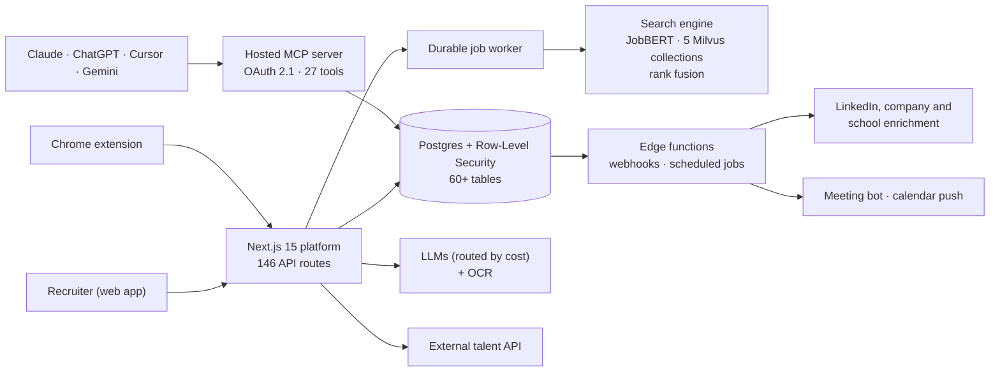

# Lope

**[View the full interactive case study →](https://nikosmav.github.io/lope-case-study/)** — videos play inline there.

AI-native recruitment CRM that turns a role brief into a ranked, explainable candidate shortlist — built by a team of three co-founders and run in production with recruiting agencies.

- **Project period:** March 2025 – September 2026
- **Team:** Nikos Mavrapidis ([@NikosMav](https://github.com/NikosMav)), Dimitrios Foteinos ([@dfwteinos](https://github.com/dfwteinos)), Anastasios Melidonis ([@Anastasios084](https://github.com/Anastasios084))
- **Status:** Paused in September 2026; the production service has been wound down

[Watch AI Scout in action (2:15)](assets/videos/ai-scout.mp4)

## The idea

Boutique technical recruitment agencies work across LinkedIn, spreadsheets, an applicant-tracking system and a notetaker. Two problems dominate: **sourcing is slow and opaque**, and the context a recruiter needs to defend a candidate is **scattered across tools**.

AI sourcing tools that search better tend to return a bare match score — and a recruiter cannot hand a black-box number to a client. Lope's bet was **explainability**: every candidate's fit is broken down criterion by criterion (title, skills, experience, location, industry), as evidence a recruiter can put in front of a hiring manager.

## What we built

One multi-tenant platform covering the recruiting lifecycle — source → enrich → evaluate → interview → collaborate → track:

- **AI Scout** — a plain-language role brief becomes structured filters and a ranked list from the internal database, an external talent database, or both, with a per-criterion match breakdown on every result
- **Search Agent** — a conversational front door built as a deterministic orchestrator: the model extracts and phrases, code owns every decision
- **Enrichment pipeline** — LinkedIn profiles, companies and schools enriched automatically through webhook-driven serverless functions; CV parsing via OCR followed by structured LLM extraction
- **Candidate CRM** — 7-stage pipeline as table and drag-and-drop Kanban, shortlists with AI evaluation against a client brief, public share links, CSV import
- **Interview intelligence** — Google Calendar and Microsoft 365 sync, a meeting bot that records and diarizes, templated AI summaries, and an interview chat whose citations are verified against the transcript
- **Companies intelligence** — "recruit-from" company pages showing which of your candidates work there today
- **Chrome extension** — a LinkedIn side panel, published on the Chrome Web Store
- **Lope MCP** — a hosted Model Context Protocol server with 27 tools and OAuth 2.1 capability-scoped grants, so Claude, ChatGPT, Cursor and Gemini can use the CRM directly

## See it in action

These videos were recorded on the live product in July 2026 and sent to our customers as onboarding material. Candidate names and photos are blurred.

| Search Agent | Interview intelligence |
| --- | --- |
|  |  |
| A conversational agent asks the follow-up questions and hands a well-formed brief to AI Scout. [1:49](assets/videos/search-agent.mp4) | Transcript, templated summary and a chat whose every answer cites the exact transcript moment. [0:51](assets/videos/interview-intelligence.mp4) |

| Lope inside Claude (MCP) | Chrome extension on LinkedIn |
| --- | --- |
|  |  |
| OAuth consent with capability-scoped permissions, then the CRM answering questions from inside Claude. [0:43](assets/videos/lope-in-claude-mcp.mp4) | Spots candidates already in your database and adds new ones — fully enriched — in one click. [0:54](assets/videos/chrome-extension.mp4) |

## Results in production

Measured from the production database on the day the project was paused, with internal and test accounts excluded.

| | |
| --- | --- |
| External recruiters signed up | **23** — 10 recruiting agencies, 3 in-house teams, 2 freelancers |
| Completed onboarding | **74%** |
| Connected a work calendar | **13** recruiters |
| Customer interviews flowing through Lope | **1,510** |
| Candidates sourced by customers through AI Scout | **799** |
| Candidate records under management | **22,123** |
| Longest customer engagement | **75 days** (a design-partner agency running three recruiters on Lope) |

Recruiters found Lope through LinkedIn, word of mouth, Slack and Discord communities, search, Reddit, a newsletter, a conference — and three through AI assistants (ChatGPT and Perplexity). We supported them through a dedicated Slack community, shipped five release notes in eighteen days in July 2026, and produced eleven onboarding videos.

Active use was concentrated: most sign-ups tried the product once, while a design-partner agency adopted it across interviews and sourcing. That concentration is part of why we paused (see *What we learned*).

## Reliability and benchmarks

| Pipeline (real production workload) | Volume | Success |
| --- | --- | --- |
| LinkedIn profile enrichment | 2,983 profiles | **98.7%** (median job 51 s) |
| Company enrichment | 3,758 companies | **99.5%** |
| AI Scout runs, all modes | 243 runs | **95.9%** |
| Customers' internal and mixed AI Scout runs | 24 runs | **100%** (median 11.2 s end-to-end) |
| AI shortlist evaluation (LLM-as-judge) | 701 evaluations | **99.0%** |
| Automated test suite | 1,308 tests | **100%** of non-skipped tests passing |

A live benchmark against the search engine returned standard queries in **3.1–3.6 s** over a workspace-sized pool of 500 candidates, with top matches scoring 0.86–0.98 and zero errors across 103 requests. Industry-filtered and full-career-history queries were the expensive paths (11–14 s), and on a single CPU-only VM the engine served concurrent requests one at a time — acceptable for pilot load, and the clear next scaling step.

A controlled experiment on external search proved the "current + past role" query logic correct (every current-role result was also returned in current + past mode) and traced an apparent bug to non-deterministic LLM synonym generation, which we then pinned. The same run quantified an industry-filter leak — 7 of 11 results off-target — and validated the fix at 4 of 4 on-target.

## Architecture

## Selected technical decisions

- **Domain-specific retrieval.** Each candidate is embedded with JobBERT into five separate vector collections. Each criterion is searched on its own and fused by rank aggregation, so every result carries its own sub-scores — that is what makes the ranking explainable.
- **The LLM is never the control plane.** Search orchestration, the industry resolver and salary explanations share one pattern: code owns decisions, the model handles fuzzy language, and every output snaps back onto a validated value.
- **Hallucination-proof where it matters.** Industries resolve exact → fuzzy → model-choosing-from-the-stored-taxonomy; salary figures are computed, never generated; interview-chat citations are checked server-side before they render.
- **Multi-tenant all the way down.** Row-level security on every table, with public/private scope enforced through a chain of access functions from team space to interview, and vectors isolated per environment.
- **Model routing by cost.** Small models classify, mid-size models extract, larger models reason, a dedicated model does OCR; content-hash caching means identical inputs are never billed twice.
- **Production discipline.** Long-running work goes to lease-based background jobs instead of serverless calls; releases on the backend VM are immutable and commit-addressed.

## Selected screens

### Companies intelligence

Where your candidates work today, which companies are already clients, and firmographics at a glance. Shown on a demo workspace; the "client" badge refers to that workspace's own demo client, not a Lope customer.

| Onboarding | Industry tagging |
| --- | --- |
|  |  |

### Experience measured by job title

## What we learned

- **Breadth is the trap for a small team.** Every surface — sourcing, notetaking, CRM, pipeline — competes with a funded specialist. Our own strategy review concluded we should subtract and focus on explainable sourcing, the part that was genuinely hard to copy.
- **Read usage from the database, not only the analytics tool.** Event tracking lagged the product: analytics alone said nobody reached the core workflow, while the database showed active users hitting coverage limits.
- **Defaults decide adoption.** The meeting bot produced a transcript 77% of the time it was switched on, but recruiters switched it on for only 13% of interviews because auto-join defaulted off.
- **Pin LLM outputs that feed queries.** An apparent logic bug turned out to be regenerated synonyms; any model output that shapes a search is now cached per search.
- **Scheduled systems need rate alarms.** A rescheduling loop created thousands of bot records for one customer's meetings without tripping an error alert. Volume anomalies deserve alerts too.

## Engineering scale

1,743 commits across two repositories · 243 merged pull requests · ~350k lines of TypeScript and Python · 144 database migrations · 20 serverless functions · 1,272 automated tests.

## My role

As one of three co-founders, I (Nikos) was the largest contributor to the web platform. I built the core recruiter workspace (data grid, Kanban pipeline, candidate sheet, comparison view, CSV import), designed the row-level-security access model that enforces public/private visibility across the product, built interview collaboration (comments with @mentions, edit history, activity, external share links) and Companies intelligence, improved ranking quality in the search engine, and owned much of the test suite, CI, deployment and production operations.

## Repository note

Lope was a team project. The platform source code, search engine, customer data, production infrastructure and credentials remain private. This repository contains only a public case study. Customer organizations are not named, and candidate names and photos in the videos and screenshots are blurred. See [NOTICE.md](NOTICE.md).
