# Lope

[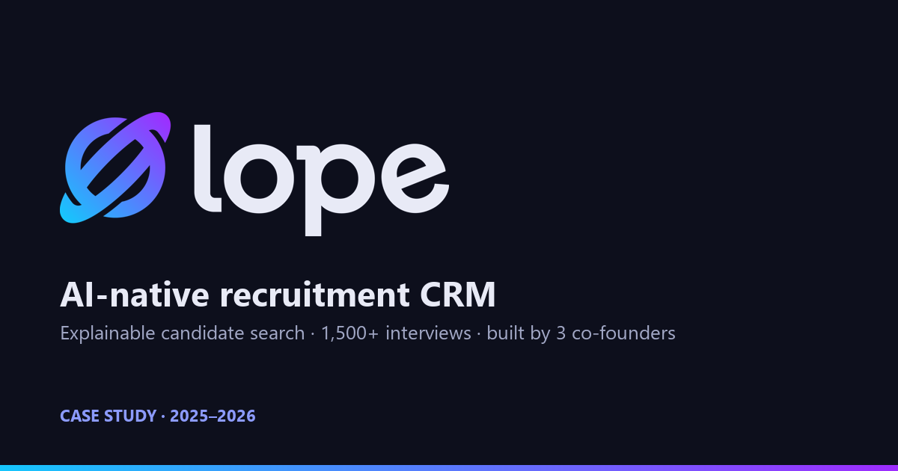](https://nikosmav.github.io/lope-case-study/)

**[View the full interactive case study →](https://nikosmav.github.io/lope-case-study/)** — videos play inline there.

AI-native recruitment CRM that turns a role brief into a ranked, explainable candidate shortlist — built by a team of three co-founders and run in production with recruiting agencies.

- **Project period:** March 2025 – September 2026
- **Team:** Nikos Mavrapidis ([@NikosMav](https://github.com/NikosMav)), Dimitrios Foteinos ([@dfwteinos](https://github.com/dfwteinos)), Anastasios Melidonis ([@Anastasios084](https://github.com/Anastasios084))
- **Status:** Paused in September 2026; the production service has been wound down

[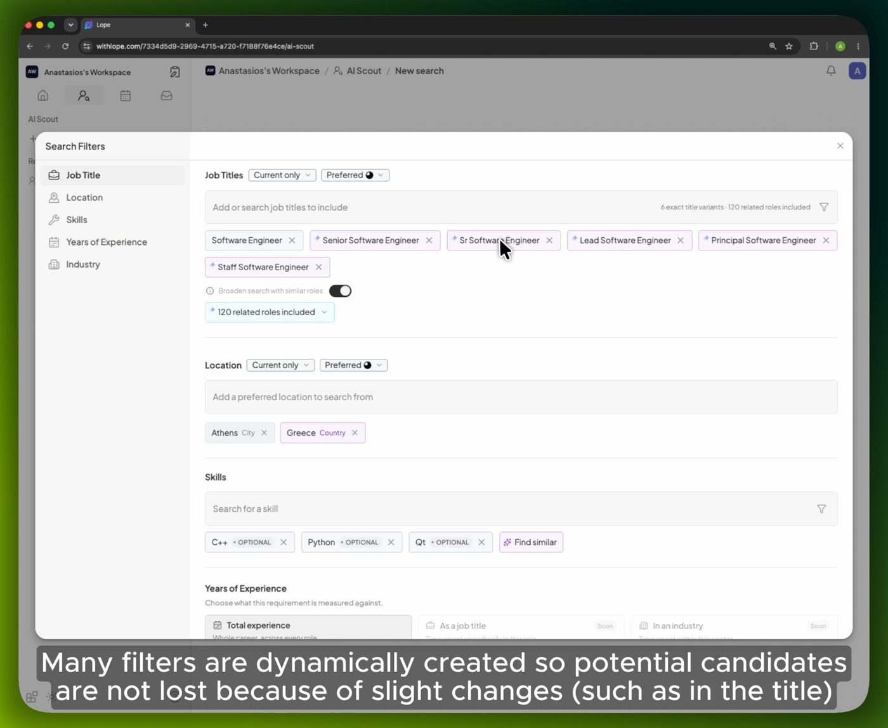](assets/videos/ai-scout.mp4)

[Watch AI Scout in action (2:15)](assets/videos/ai-scout.mp4)

## The idea

Boutique technical recruitment agencies work across LinkedIn, spreadsheets, an applicant-tracking system and a notetaker. Two problems dominate: **sourcing is slow and opaque**, and the context a recruiter needs to defend a candidate is **scattered across tools**.

AI sourcing tools that search better tend to return a bare match score — and a recruiter cannot hand a black-box number to a client. Lope's bet was **explainability**: every candidate's fit is broken down criterion by criterion (title, skills, experience, location, industry), as evidence a recruiter can put in front of a hiring manager.

## What we built

One multi-tenant platform covering the recruiting lifecycle — source → enrich → evaluate → interview → collaborate → track:

- **AI Scout** — a plain-language role brief becomes structured filters and a ranked list from the internal database, an external talent database, or both, with a per-criterion match breakdown on every result
- **Search Agent** — a conversational front door built as a deterministic orchestrator: the model extracts and phrases, code owns every decision
- **Enrichment pipeline** — LinkedIn profiles, companies and schools enriched automatically through webhook-driven serverless functions; CV parsing via OCR followed by structured LLM extraction
- **Candidate CRM** — 7-stage pipeline as table and drag-and-drop Kanban, shortlists with AI evaluation against a client brief, public share links, CSV import
- **Interview intelligence** — Google Calendar and Microsoft 365 sync, a meeting bot that records and diarizes, templated AI summaries, and an interview chat whose citations are verified against the transcript
- **Companies intelligence** — "recruit-from" company pages showing which of your candidates work there today
- **Chrome extension** — a LinkedIn side panel, published on the Chrome Web Store
- **Lope MCP** — a hosted Model Context Protocol server with 27 tools and OAuth 2.1 capability-scoped grants, so Claude, ChatGPT, Cursor and Gemini can use the CRM directly
- **Help center** — a 42-page public documentation site with a changelog of 13 releases between March and July 2026

### Feature highlights

| Ranked, shareable shortlists | Skill inference, with the receipts |
| --- | --- |
| 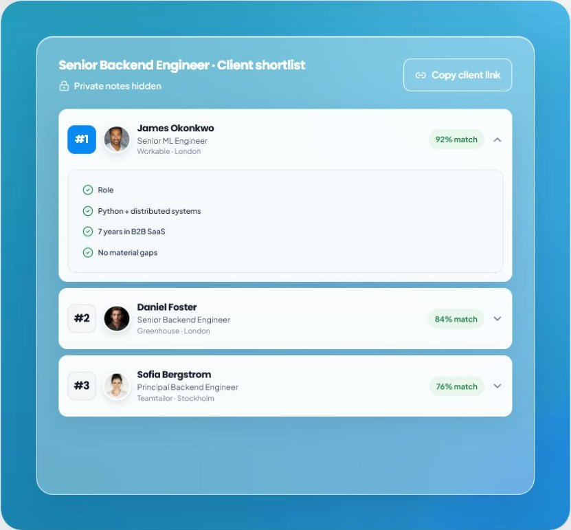 | 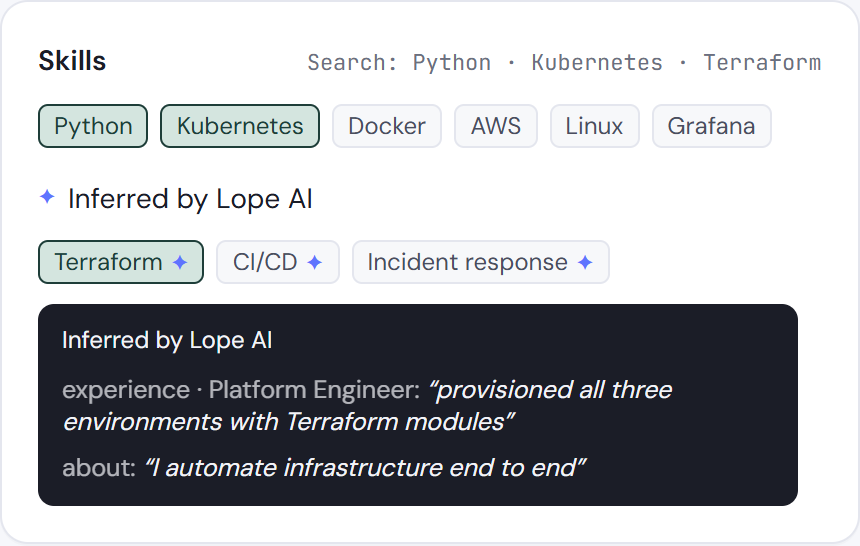 |
| Every shortlisted candidate is evaluated against a versioned client brief, ranked and explained; one link shares a read-only client view with private notes hidden. 701 AI evaluations at 99.0% success; 68 shared links, 96 external views. | The last feature we shipped: Lope credits skills a profile proves in its own words and shows the quote. An LLM may only answer with a verbatim quote and a curated skill — 1,345 candidates gained evidence, 0 unverifiable quotes in audit. *Recreated from the product component with illustrative data.* |

| From a job to a search in one step | Scattered signals, one searchable profile |
| --- | --- |
| 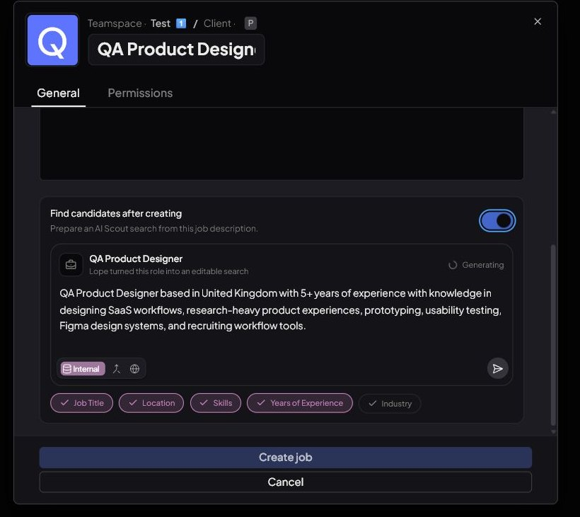 | 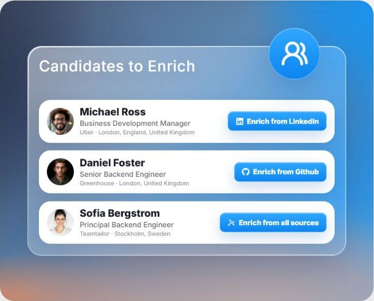 |
| Creating a job can prepare the search: Lope turns the job description into an editable AI Scout brief and lets you fine-tune every signal, with advanced weights, before searching. | LinkedIn, the Chrome extension, CVs (including bulk ZIP) and CSV become one enriched, indexed profile — 98.7% success over ~3,000 profiles. |

<b>Everything else in the product</b>

- **Source** — AI Scout across your database, an external talent source, or both · Search Agent · search from a job description · Chrome extension for LinkedIn and Recruiter Lite, including bulk add · CSV import with field mapping · CV import including bulk ZIP · industry tagging from a company name · years of experience measured by job title · current, recent or full-career title matching
- **Evaluate** — per-criterion match explanations and relevance bands · skill inference with source quotes · synonym- and composition-aware skill matching · must-have vs optional skills · candidate-fit verdict against a job · AI shortlist evaluation and ranking · side-by-side comparison of 2–4 candidates · salary bands with an explained position
- **Interview** — Google and Microsoft calendar sync · meeting bot for Meet and Teams (auto-join, custom name and avatar, many languages including Greek) · speaker-diarized transcripts · templated, editable AI reports · interview chat with verified citations · PDF export and transcript download
- **Organize and collaborate** — Workspace → Teamspace → Client → Job hierarchy · public/private permissions and roles · team invitations · 7-stage pipeline as a table and Kanban board · custom candidate fields · comments, @mentions and activity · read-only links for shortlists, searches and interviews
- **Know your market** — Companies (where your talent works, client badges, firmographics) · candidate tracking across 8 change types · in-app notifications and email digests · one candidate sheet for LinkedIn, GitHub and CV data
- **Platform** — Lope MCP with 27 tools · API keys · guided onboarding and product tours · help center and public changelog

## See it in action

These videos were recorded on the live product in July 2026 and sent to our customers as onboarding material. Candidate names and photos are blurred.

| Search Agent | Interview intelligence |
| --- | --- |
| [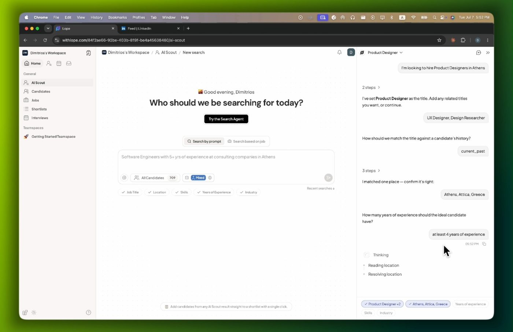](assets/videos/search-agent.mp4) | [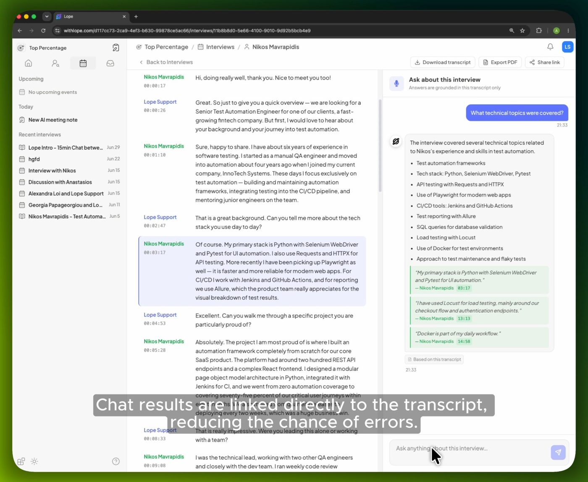](assets/videos/interview-intelligence.mp4) |
| A conversational agent asks the follow-up questions and hands a well-formed brief to AI Scout. [1:49](assets/videos/search-agent.mp4) | Transcript, templated summary and a chat whose every answer cites the exact transcript moment. [0:51](assets/videos/interview-intelligence.mp4) |

| Lope inside Claude (MCP) | Chrome extension on LinkedIn |
| --- | --- |
| [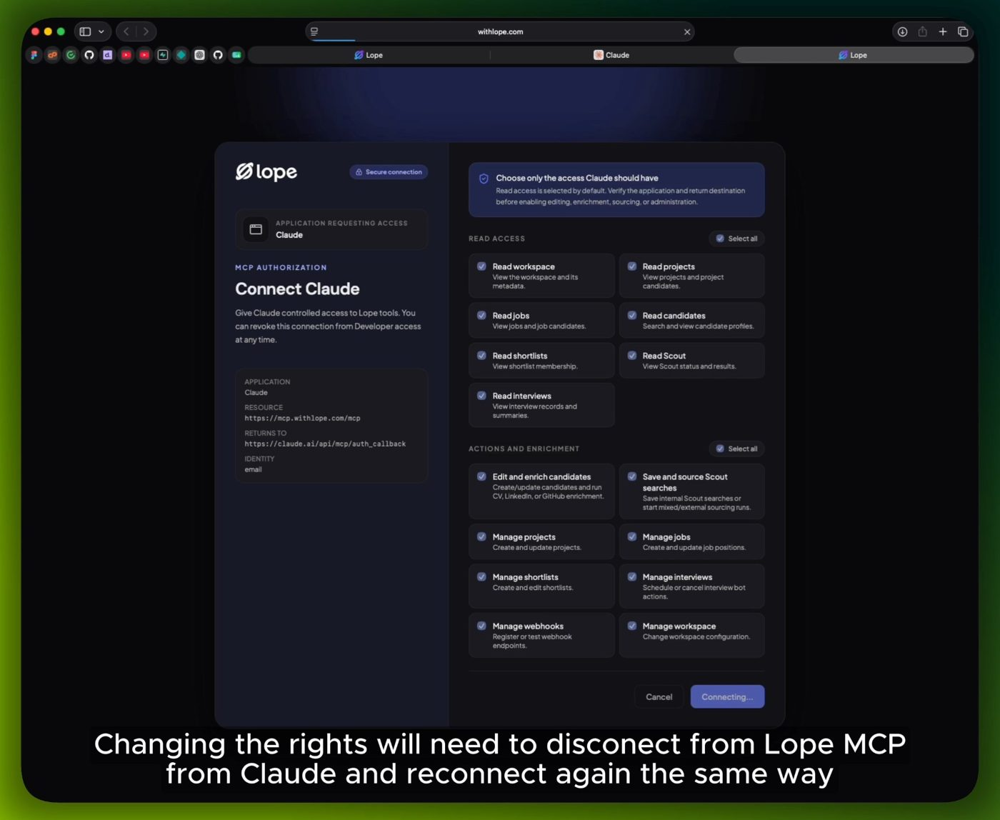](assets/videos/lope-in-claude-mcp.mp4) | [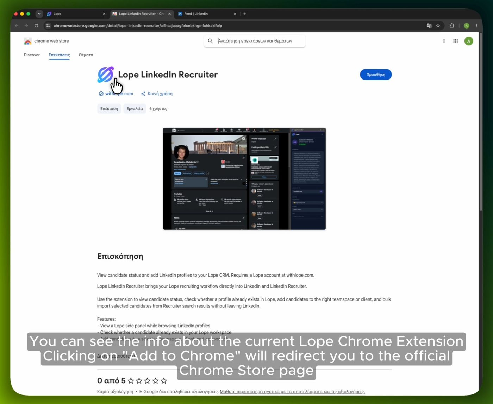](assets/videos/chrome-extension.mp4) |
| OAuth consent with capability-scoped permissions, then the CRM answering questions from inside Claude. [0:43](assets/videos/lope-in-claude-mcp.mp4) | Spots candidates already in your database and adds new ones — fully enriched — in one click. [0:54](assets/videos/chrome-extension.mp4) |

## Results in production

Measured from the production database on the day the project was paused, with internal and test accounts excluded.

| | |
| --- | --- |
| External recruiters signed up | **23** — 10 recruiting agencies, 3 in-house teams, 2 freelancers |
| Completed onboarding | **74%** |
| Connected a work calendar | **13** recruiters |
| Customer interviews flowing through Lope | **1,510** |
| Candidates sourced by customers through AI Scout | **799** |
| Candidate records under management | **22,123** |
| Longest customer engagement | **75 days** (a design-partner agency running three recruiters on Lope) |

Recruiters found Lope through LinkedIn, word of mouth, Slack and Discord communities, search, Reddit, a newsletter, a conference — and three through AI assistants (ChatGPT and Perplexity). We supported them through a dedicated Slack community, shipped five release notes in eighteen days in July 2026, and produced eleven onboarding videos.

Active use was concentrated: most sign-ups tried the product once, while a design-partner agency adopted it across interviews and sourcing. That concentration is part of why we paused (see *What we learned*).

## Reliability and benchmarks

| Pipeline (real production workload) | Volume | Success |
| --- | --- | --- |
| LinkedIn profile enrichment | 2,983 profiles | **98.7%** (median job 51 s) |
| Company enrichment | 3,758 companies | **99.5%** |
| AI Scout runs, all modes | 243 runs | **95.9%** |
| Customers' internal and mixed AI Scout runs | 24 runs | **100%** (median 11.2 s end-to-end) |
| AI shortlist evaluation (LLM-as-judge) | 701 evaluations | **99.0%** |
| Automated test suite | 1,308 tests | **100%** of non-skipped tests passing |

A live benchmark against the search engine returned standard queries in **3.1–3.6 s** over a workspace-sized pool of 500 candidates, with top matches scoring 0.86–0.98 and zero errors across 103 requests. Industry-filtered and full-career-history queries were the expensive paths (11–14 s), and on a single CPU-only VM the engine served concurrent requests one at a time — acceptable for pilot load, and the clear next scaling step.

Search quality kept improving after launch. **Evidence-based skill matching** credits skills a candidate describes in their own words, not only the ones they tagged: a deterministic extractor plus an LLM pass whose every answer must quote the profile verbatim and map to a curated vocabulary. 1,345 production candidates gained evidence, and audits found 0 unverifiable quotes and 0 off-vocabulary skills across 855 LLM-inferred matches, for about $0.50 of backfill. A curated **synonym and composition layer** ("JS" = JavaScript; "SQL Databases" = SQL + Databases, with guardrails) shipped behind a before/after evaluation harness.

A controlled experiment on external search proved the "current + past role" query logic correct (every current-role result was also returned in current + past mode) and traced an apparent bug to non-deterministic LLM synonym generation, which we then pinned. The same run quantified an industry-filter leak — 7 of 11 results off-target — and validated the fix at 4 of 4 on-target.

## Architecture

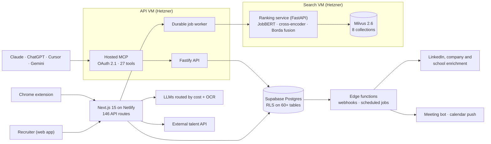

## Built with

64 technologies and services across the three repositories and the production setup.

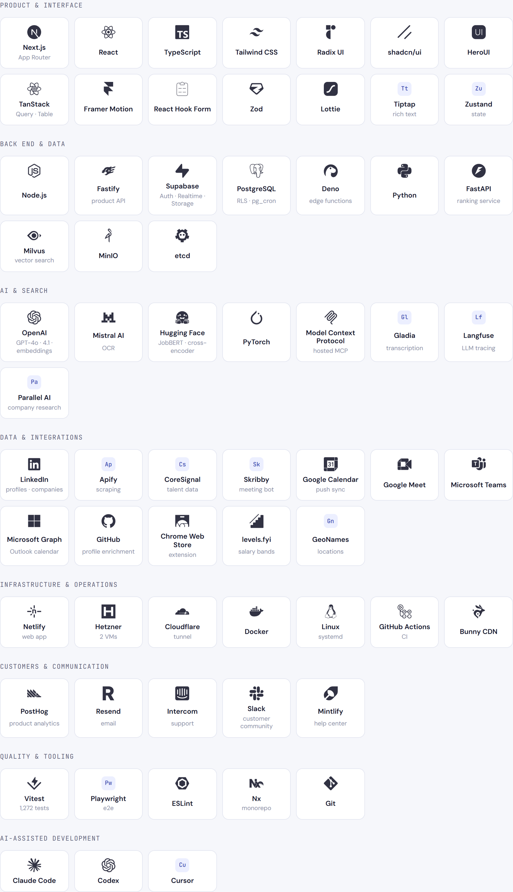

Text list

- **Product & interface** — Next.js, React, TypeScript, Tailwind CSS, Radix UI, shadcn/ui, HeroUI, TanStack Query & Table, Framer Motion, React Hook Form, Zod, Lottie, Tiptap, Zustand
- **Back end & data** — Node.js, Fastify, Supabase (Postgres, Auth, Realtime, Storage), PostgreSQL with RLS and pg_cron, Deno edge functions, Python, FastAPI, Milvus, MinIO, etcd
- **AI & search** — OpenAI (GPT-4o, GPT-4.1, embeddings), Mistral AI (OCR), Hugging Face (JobBERT, cross-encoder), PyTorch, Model Context Protocol, Gladia, Langfuse, Parallel AI
- **Data & integrations** — LinkedIn (via Apify), Apify, CoreSignal, Skribby, Google Calendar, Google Meet, Microsoft Teams, Microsoft Graph, GitHub, Chrome Web Store, levels.fyi, GeoNames
- **Infrastructure & operations** — Netlify, Hetzner (2 VMs), Cloudflare Tunnel, Docker, Linux/systemd, GitHub Actions, Bunny CDN
- **Customers & communication** — PostHog, Resend, Intercom, Slack, Mintlify
- **Quality & tooling** — Vitest, Playwright, ESLint, Nx, Git
- **AI-assisted development** — Claude Code, Codex, Cursor

## Selected technical decisions

- **Multi-signal, explainable retrieval.** Job titles are matched three ways at once — OpenAI `text-embedding-3-large`, JobBERT-v3 (a model trained on job titles) and BM25 keywords — fused with weighted reciprocal-rank fusion and reranked by a cross-encoder. Skills, location, experience and industry each have their own index: eight Milvus collections feed five scored dimensions, merged by grouped Borda rank aggregation. Every result keeps its per-dimension scores, which is what makes the ranking explainable.
- **The LLM is never the control plane.** Search orchestration, the industry resolver and salary explanations share one pattern: code owns decisions, the model handles fuzzy language, and every output snaps back onto a validated value.
- **Hallucination-proof where it matters.** Industries resolve exact → fuzzy → model-choosing-from-the-stored-taxonomy; salary figures are computed, never generated; interview-chat citations are checked server-side before they render.
- **Multi-tenant all the way down.** Row-level security on every table, with public/private scope enforced through a chain of access functions from team space to interview, and vectors isolated per environment.
- **Model routing by cost.** Small models classify, mid-size models extract, larger models reason, a dedicated model does OCR; content-hash caching means identical inputs are never billed twice.
- **Production discipline.** Long-running work goes to lease-based background jobs instead of serverless calls. Two Hetzner VMs — product API and search — each run immutable, commit-addressed releases with health checks and rollback, key-only SSH, firewalls, internal database ports closed to the internet, zero-downtime secret rotation, and a Cloudflare Tunnel in front of the API.
- **The ranking service only ranks what it is given.** The product decides which candidates a caller may see and sends that allowlist; the search engine never authorizes tenants, and results are re-read from Postgres under workspace rules before they are shown.

## Selected screens

### Companies intelligence

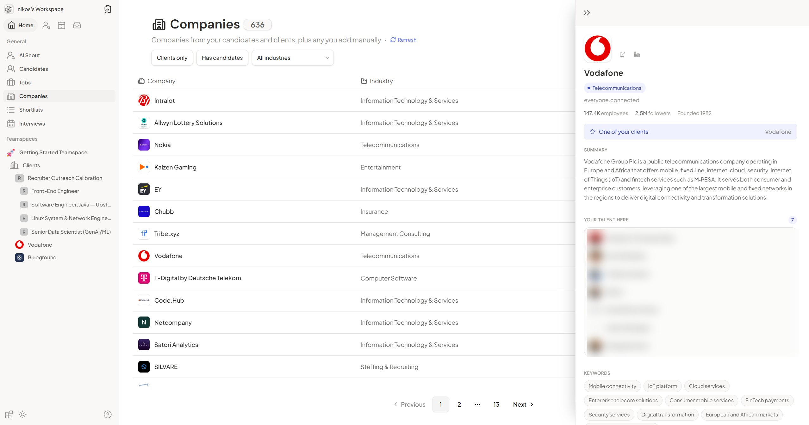

Where your candidates work today, which companies are already clients, and firmographics at a glance. Shown on a demo workspace; the "client" badge refers to that workspace's own demo client, not a Lope customer.

| Onboarding | Industry tagging |
| --- | --- |
| 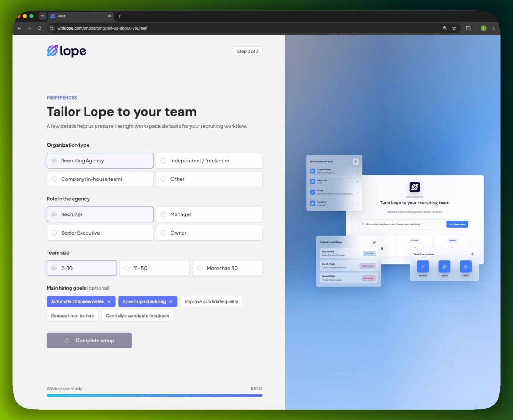 | 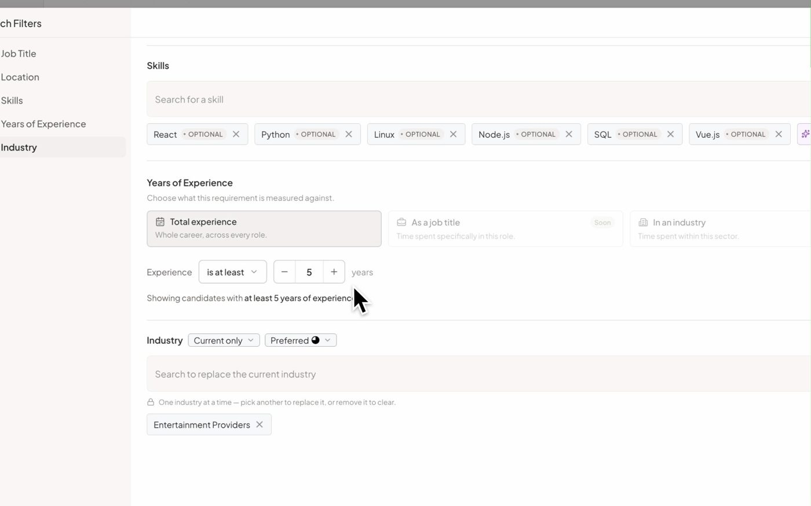 |

### Experience measured by job title

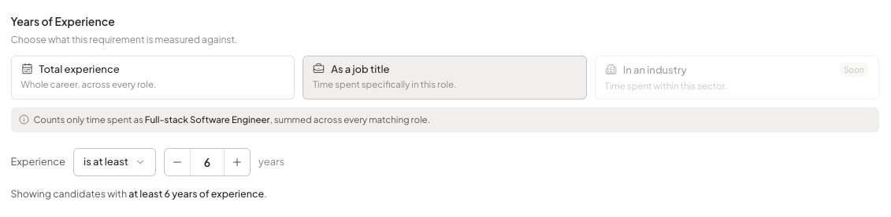

## What we learned

- **Breadth is the trap for a small team.** Every surface — sourcing, notetaking, CRM, pipeline — competes with a funded specialist. Our own strategy review concluded we should subtract and focus on explainable sourcing, the part that was genuinely hard to copy.
- **Read usage from the database, not only the analytics tool.** Event tracking lagged the product: analytics alone said nobody reached the core workflow, while the database showed active users hitting coverage limits.
- **Defaults decide adoption.** The meeting bot produced a transcript 77% of the time it was switched on, but recruiters switched it on for only 13% of interviews because auto-join defaulted off.
- **Pin LLM outputs that feed queries.** An apparent logic bug turned out to be regenerated synonyms; any model output that shapes a search is now cached per search.
- **Scheduled systems need rate alarms.** A rescheduling loop created thousands of bot records for one customer's meetings without tripping an error alert. Volume anomalies deserve alerts too.

## Engineering scale

1,819 commits across three repositories (platform, search engine, help center) · 243 merged pull requests · ~350k lines of TypeScript and Python · 144 database migrations · 20 serverless functions · 1,272 automated tests.

## My role

I worked across the whole platform — product, front end, back end, data, AI search, infrastructure and documentation — and was the most active contributor in both code repositories (622 of 1,649 platform commits; 45 of 94 search-engine commits).

- **Product and front end** — the recruiter workspace: candidate data grid and Kanban pipeline, candidate sheet, side-by-side comparison, CSV import, shortlist review and sharing, guided onboarding, Companies intelligence, interview collaboration, and the marketing site.
- **Back end and data** — the row-level-security access model and roles that enforce public/private scope across the product, candidate de-duplication, Postgres functions and migrations, and calendar-sync consolidation.
- **AI search** — synonym- and composition-aware skill matching behind an evaluation harness, evidence-based skill matching with quote-verified LLM extraction, the vector-recall fix, and the code-verified architecture of the ranking engine.
- **Infrastructure and security** — immutable releases with health checks and rollback on both Hetzner VMs, server hardening, zero-downtime secret rotation, Netlify production and CI, an infrastructure audit and a security-incident review.
- **Quality** — a large share of the 1,272-test suite, production stability scans, a performance audit, and the analytics guide that made the team measure usage from the database.
- **Strategy and ways of working** — the product and go-to-market strategy, product guides in the help center, and the documented AI-assisted engineering workflow (agent contracts, code-verified docs) the team built with.

## Repository note

Lope was a team project. The platform source code, search engine, customer data, production infrastructure and credentials remain private. This repository contains only a public case study. Customer organizations are not named, and candidate names and photos in the videos and screenshots are blurred. See [NOTICE.md](NOTICE.md).
