# Lope

[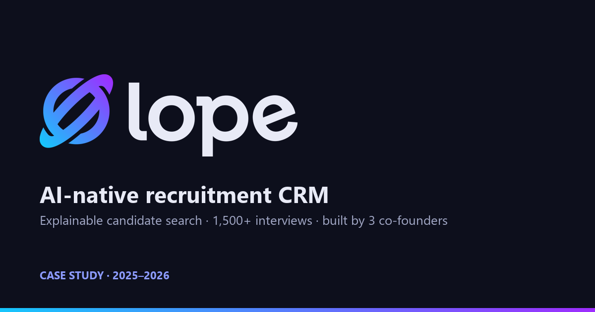](https://nikosmav.github.io/lope-case-study/)

**[View the full interactive case study →](https://nikosmav.github.io/lope-case-study/)** (the videos play inline there)

Lope is a recruitment CRM built around one idea: a recruiter describes a role in plain language, and **AI Scout** returns a ranked shortlist in which every candidate's fit is explained criterion by criterion. Everything else in the product exists to feed that search or act on its results.

- **Project period:** built March 2025 – July 2026; paused September 2026
- **Team:** three co-founders, three repositories: Nikos Mavrapidis ([@NikosMav](https://github.com/NikosMav)), Dimitrios Foteinos ([@dfwteinos](https://github.com/dfwteinos)), Anastasios Melidonis ([@Anastasios084](https://github.com/Anastasios084))
- **Status:** paused in September 2026; the production service has been wound down
- **Links:** [withlope.com](https://www.withlope.com/) · [Lope on LinkedIn](https://www.linkedin.com/company/withlope)

## The idea

Boutique technical recruitment agencies work across LinkedIn, spreadsheets, an applicant-tracking system and a notetaker. Two problems dominate:

- **Sourcing is slow and opaque.** AI sourcing tools that search better usually return a bare match score, and a recruiter can't show a client a score with no reasoning behind it.
- **What recruiters know about a candidate is scattered.** The LinkedIn profile, the CV, the GitHub account and the interview notes all live in different tools.

Lope's bet was to bring every source into **one candidate profile**, then rank with **evidence**: every candidate's fit is explained criterion by criterion (title, skills, experience, location, industry) in a form a recruiter can hand to a hiring manager. AI Scout does the ranking, and the rest of the product either feeds it candidates or acts on what it finds. This case study follows the same order.

### One profile, every source

| Source | How it gets into Lope |
| --- | --- |
| **LinkedIn** | Enriched automatically from a URL, the Chrome extension or an AI Scout result, including current company and school (3,246 profiles) |
| **External talent database** | AI Scout's external and mixed searches import and enrich new profiles (799 sourced by customers) |
| **CVs** | OCR plus structured extraction, one at a time or as a bulk ZIP upload |
| **GitHub** | Public repositories, languages and commit activity |
| **Interviews** | Calendar sync creates candidates from meetings (228), and the meeting bot adds transcripts, AI reports and team comments |
| **CSV and manual entry** | CSV import with field mapping, manual adds, custom fields |

AI Scout ranks candidates on the structured profile built from LinkedIn data. CV, GitHub and interview evidence appears in the candidate sheet, the interview chat and candidate reports. Bringing that evidence into the ranking was the next planned step.

[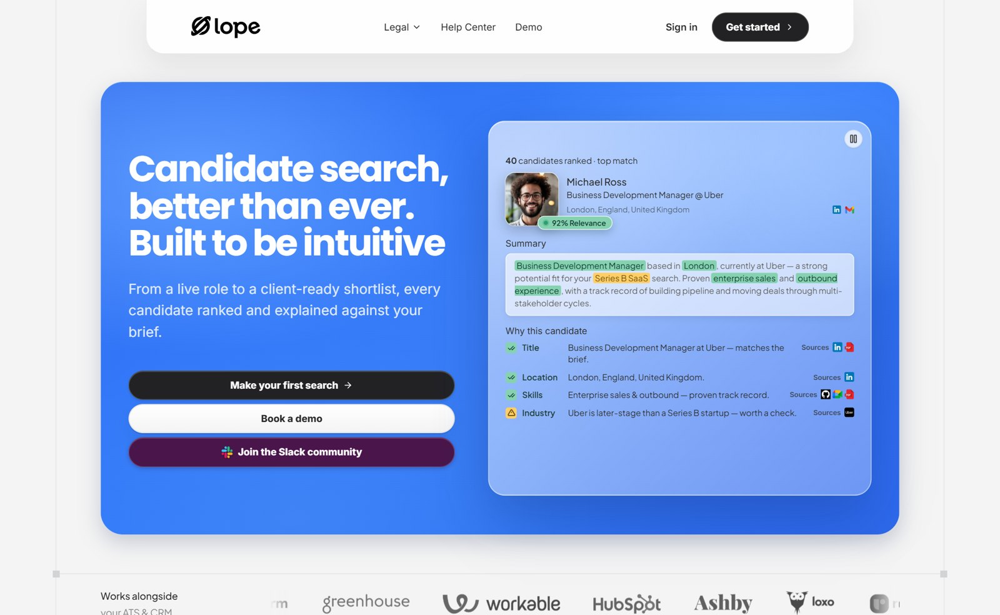](https://www.withlope.com/)

*[withlope.com](https://www.withlope.com/), captured 23 September 2026. Its hero demo turns a brief into a ranked, explained candidate.*

## At a glance

Customers only, measured 23 September 2026.

| | |
| --- | --- |
| Candidates customers sourced through AI Scout | **799** |
| Customer interviews synced into Lope | **1,510** |
| Recruiters signed up | **23**, 10 of them agencies · 74% finished onboarding |
| Longest customer engagement | **75 days** (a design-partner agency) |

## AI Scout, the core of the product

[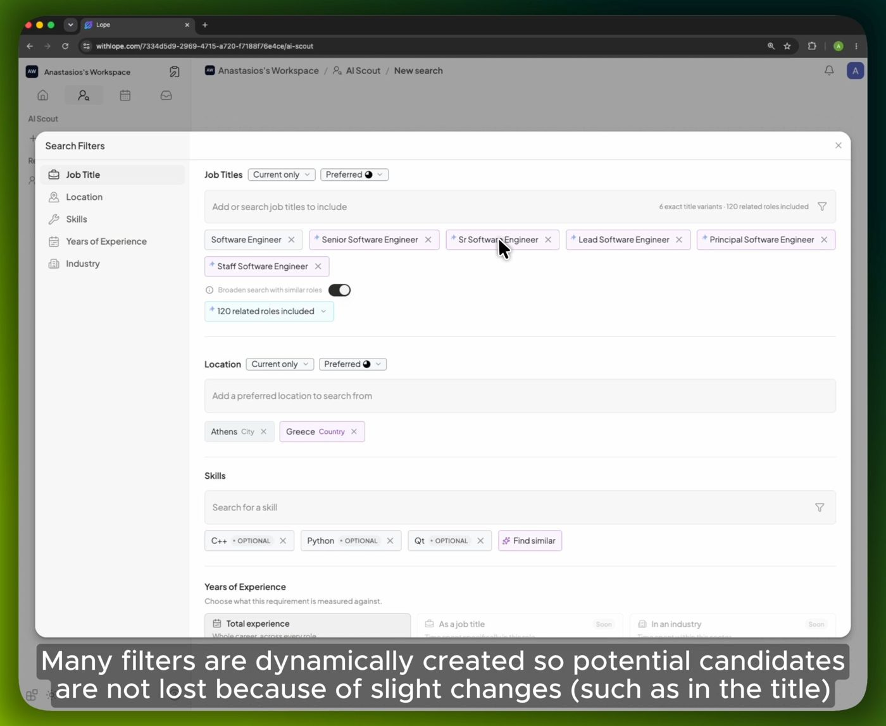](assets/videos/ai-scout.mp4)

[Watch AI Scout in action (2:15)](assets/videos/ai-scout.mp4)

A recruiter writes a brief such as *"Senior backend engineer in Athens, 6+ years, Python and Kubernetes, fintech background."* AI Scout turns it into structured, editable criteria, searches, and returns a ranked list in which each candidate shows what matched and what's missing.

| | |
| --- | --- |
| **Three ways in** | A plain-language prompt · the **Search Agent**, a conversational assistant that asks follow-up questions to sharpen the brief (beta) · **Search from a job**, which turns an existing job description into a ready-to-run search |
| **Three sources** | **Internal**, the workspace's own candidates · **External**, a third-party talent database, with new profiles imported and enriched automatically · **Mixed**, both ranked together |
| **Explained results** | Every result has a per-criterion match breakdown and a relevance band, and matched skills are highlighted with the evidence behind them, so the recruiter can defend the ranking |

Each result carries a match score and a short summary that marks every criterion: green where it matched, orange where it partly did, red where it didn't. The [case study page](https://nikosmav.github.io/lope-case-study/#scout) recreates the AI Scout review step and results list from the product's own components.

**How the ranking works.** In short: AI Scout scores every criterion separately and only then combines the scores, so it can always show why a candidate ranks where they do.

Each criterion is scored on its own. Job titles are matched three ways (OpenAI embeddings, JobBERT, a model trained on job titles, and BM25 keywords), fused, then reranked by a cross-encoder. Skills, location, experience and industry each have their own index. Eight Milvus collections feed five scored dimensions, which are merged by grouped Borda rank aggregation. Because every result keeps its per-dimension scores, each ranking can be explained.

The one known limit: on a single CPU-only VM the engine served concurrent searches one at a time, which was fine for pilot traffic.

| Search engine latency, live on 23 September 2026 | Median (p50) | Slowest 5% (p95) |
| --- | --- | --- |
| 100 candidates | 1.9 s | 7.7 s |
| 500 candidates | 3.5 s | 14.5 s |
| 1,000 candidates | 4.8 s | 17.2 s |

0 errors in 103 requests.

| AI Scout in production | |
| --- | --- |
| Searches run (all accounts, including internal and test) | **243** · 95.9% completed |
| Customers' internal and mixed searches | **100%** completed |
| Median search for customers, end to end | **11.2 s** |

## The recruiter workspace

Everything around the search, ranked by importance. Each feature gets candidates into Lope, acts on what AI Scout finds, or, in the case of Lope MCP, brings the whole CRM into the AI assistants recruiters already use.

| Feature | What it does | Status |
| --- | --- | --- |
| **Interviews** | Google and Microsoft calendar sync, a meeting bot for Meet and Teams, speaker-separated transcripts, editable AI reports from templates, and an interview chat whose citations are checked against the transcript | ✅ Shipped. Most-used feature by volume: 1,510 customer interviews synced |
| **Shortlists** | Candidates evaluated and ranked against a versioned client brief, with a read-only link for the client that hides private notes | ✅ Shipped. 701 AI evaluations at 99.0% success, 68 shared links |
| **Lope MCP** | A hosted Model Context Protocol server: add one URL in Claude, ChatGPT, Cursor or Gemini, sign in, and search candidates, run AI Scout, manage shortlists and read interviews from the assistant. 27 tools, OAuth 2.1 with scoped permissions | ✅ Shipped. Works with Claude, ChatGPT, Cursor and Gemini |
| **Candidate and company sheets** | One profile per candidate combining LinkedIn, GitHub, CV and interview data, with an AI summary across all of them, next to a company sheet with firmographics | ✅ Shipped. LinkedIn enrichment 98.7% over ~3,000 profiles |
| **Jobs** | Client → Job hierarchy; a job description becomes an editable AI Scout search, with advanced weights | ✅ Shipped |
| **Chrome extension** | A LinkedIn side panel that spots candidates already in your database and adds new ones, including bulk adds from Recruiter Lite | ✅ Shipped. Published on the Chrome Web Store |
| **Google and Microsoft accounts** | Sign in with Google or Microsoft, then connect the work calendar that drives interview sync | ✅ Shipped. 13 of 23 recruiters connected a calendar |
| **Companies** | "Recruit-from" pages: where your candidates work today, which companies are already clients, firmographics | 🟡 Shipped late (July 2026); talent-flow panel never built |
| **Collaboration** | Interview comments with @mentions, an activity feed, external share links, and public/private access with roles enforced in the database | 🟡 Partial. Interviews only; follow-up tasks and threaded comments not built |

| Interview intelligence | Lope inside Claude (MCP) |
| --- | --- |
| [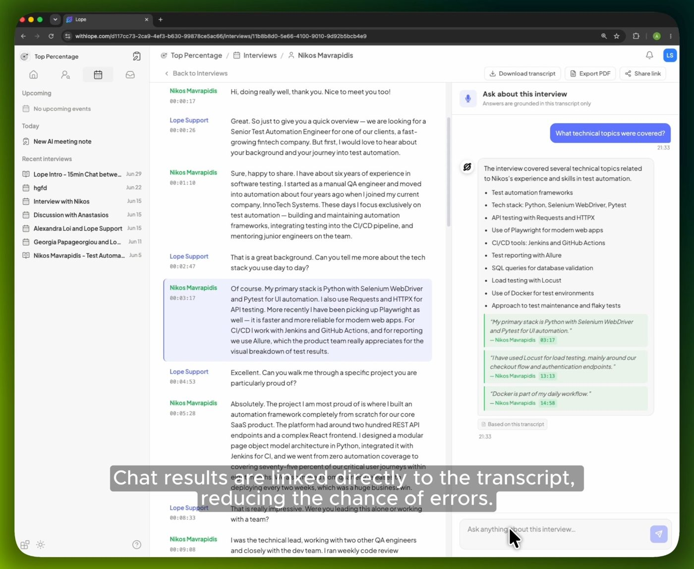](assets/videos/interview-intelligence.mp4) | [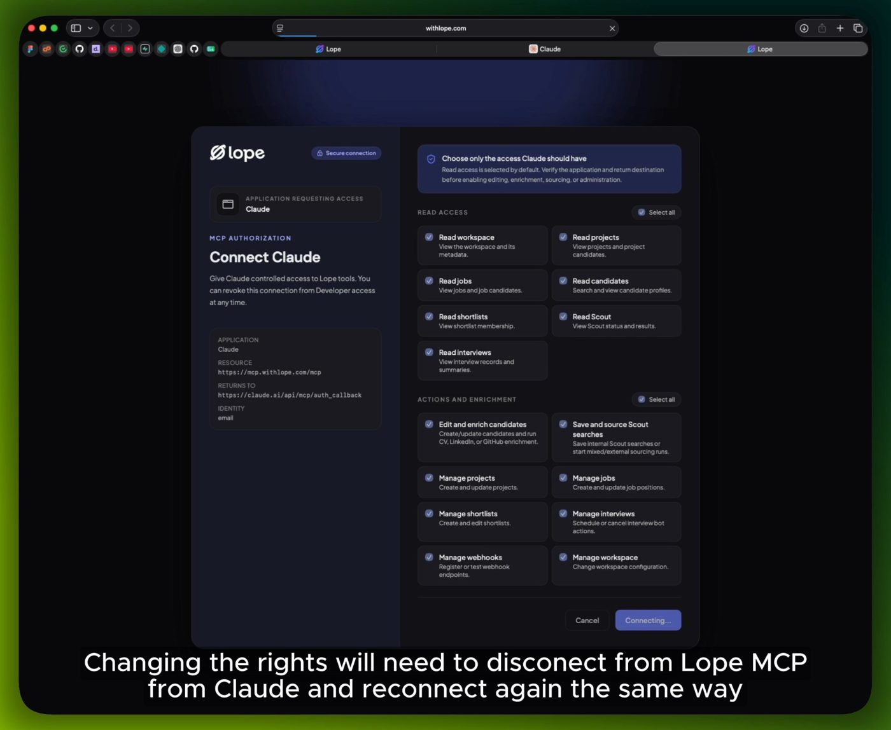](assets/videos/lope-in-claude-mcp.mp4) |
| Transcript, templated summary, and a chat that links each answer to the moment in the transcript. [0:51](assets/videos/interview-intelligence.mp4) | Sign in with scoped permissions, then ask Claude about candidates, pipelines and interviews. [0:43](assets/videos/lope-in-claude-mcp.mp4) |

| Chrome extension on LinkedIn | Ranked, shareable shortlists |
| --- | --- |
| [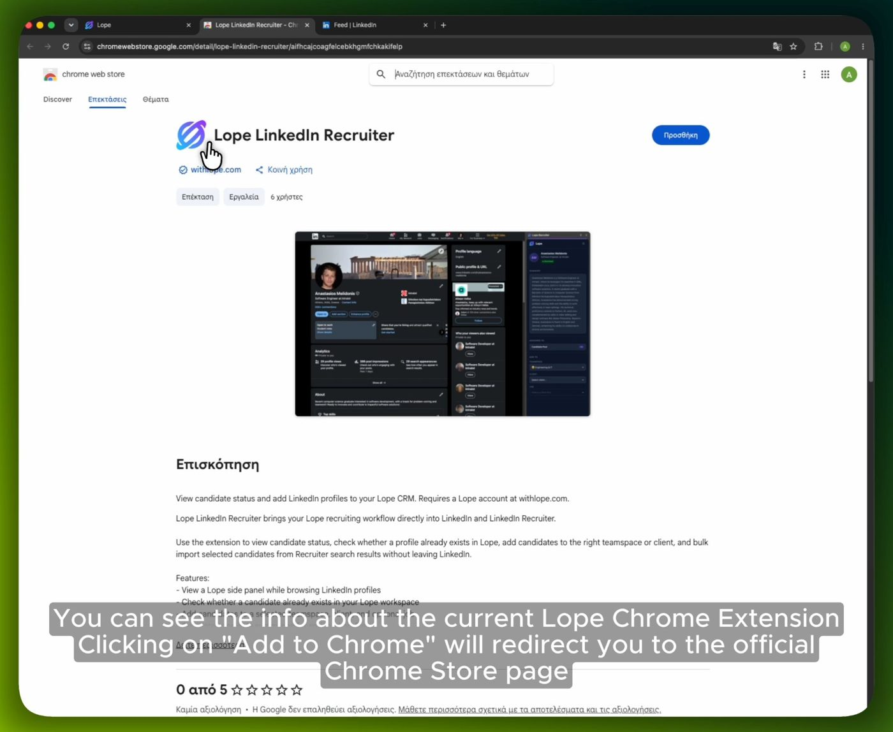](assets/videos/chrome-extension.mp4) | 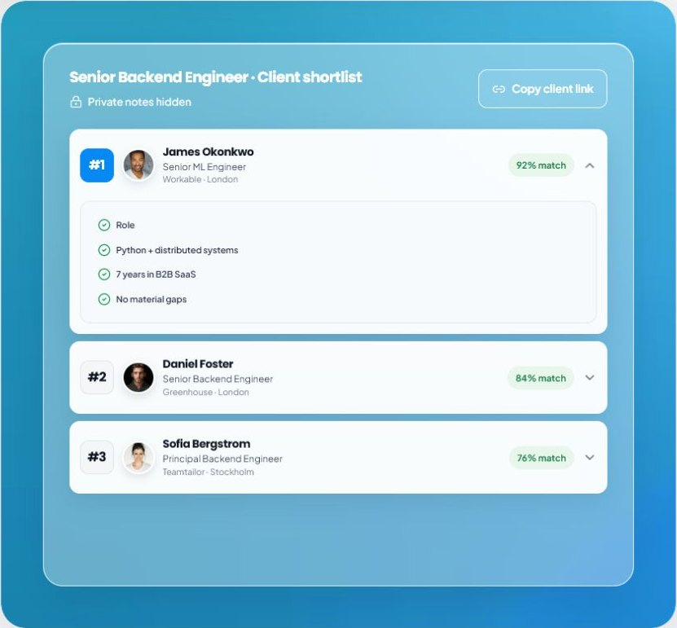 |
| Spots candidates already in your database and adds new ones, fully enriched, in one click. [0:54](assets/videos/chrome-extension.mp4) | Ranked against the client's brief, with the reasons for each position. |

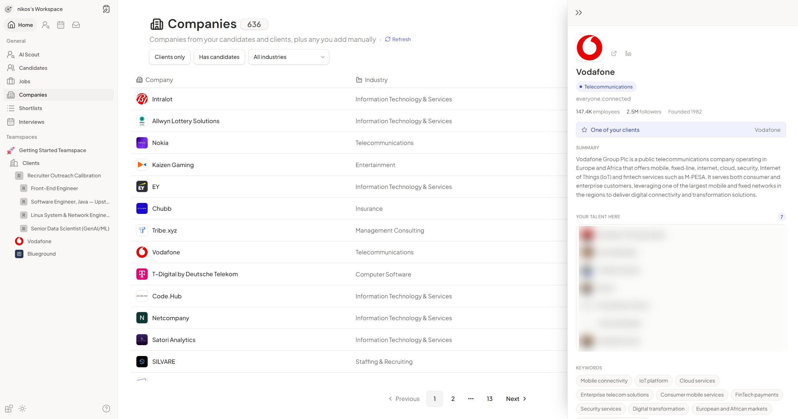

*Companies: where your talent works today and which companies are clients. Demo workspace; names blurred.*

## Smaller features

| Feature | What it does | Status |
| --- | --- | --- |
| **Criteria and filter tuning** | Suggested criteria, must-have vs optional skills, advanced weights, current/recent/full-career title matching, years of experience in a specific role, and industry inferred from a company name | ✅ Shipped |
| **Skill inference** | Credits skills a profile shows in its own words and displays the quote behind each one. An LLM may only answer with a verbatim quote and a skill from a curated list | ✅ Shipped in July 2026, the last month of active development. 1,345 candidates gained evidence, 0 unverifiable quotes in audit |
| **CSV and CV import** | CSV upload with field mapping; CV parsing with OCR and structured extraction, including bulk ZIP uploads | ✅ Shipped |
| **Salary estimation** | A salary band per role and candidate, computed from market data, with an AI explanation that is not allowed to produce numbers | 🟡 Partial. Greek market bands live; company-level adjustment unfinished |
| **Candidate tracking** | Watches LinkedIn for job changes, promotions, new skills and five other kinds of change, with in-app and email notifications | ✅ Shipped, lightly used |

| Salary estimation | Candidate tracking |
| --- | --- |
| 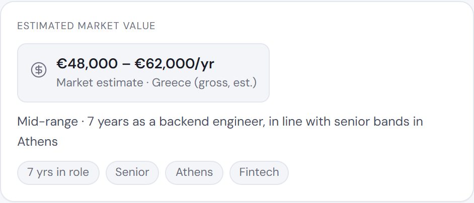 | 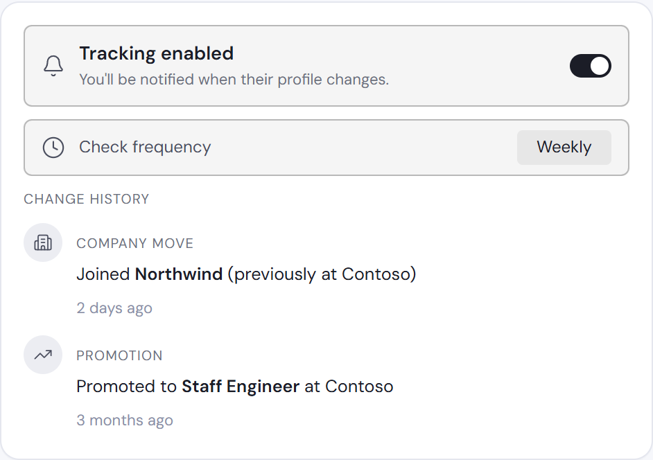 |
| The band is computed; the AI only explains where the profile sits. | Job moves, promotions, new skills and five other kinds of change, detected from LinkedIn. |

*Both recreated from the product's components, with illustrative data.*

Also in the product: custom candidate fields, a 7-stage pipeline as a table and Kanban board, API keys, guided onboarding, and a help center with a public changelog.

## Results in production

Lope launched publicly in **March 2026**. Recruiters found it through LinkedIn, word of mouth, Slack and Discord communities, search, Reddit, a newsletter, a conference, and three through **AI assistants** (ChatGPT and Perplexity).

From July 2026 a Greek technical recruitment agency ran three recruiters on Lope as a design partner: about **950 of their interviews** went through it, they ran **36 AI Scout searches** and sourced **~450 candidates**, and one recruiter used it across **75 days**.

Most other sign-ups tried the product once. That concentration is part of why we paused.

| Customer funnel (external recruiters) | |
| --- | --- |
| Signed up | **23** |
| Finished onboarding | **17** |
| Connected a calendar | **13** |
| Used a product feature | **13** |
| Active on 2+ days | **6** |

## How it was built

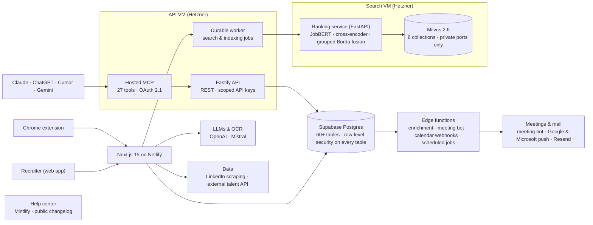
```mermaid
flowchart LR
  Recruiter["Recruiter (web app)"] --> Web["Next.js 15 on Netlify"]
  Ext["Chrome extension"] --> Web
  Agents["Claude · ChatGPT · Cursor · Gemini"] --> MCP
  Help["Help center<br/>Mintlify · public changelog"]
  subgraph APIVM["API VM (Hetzner)"]
    API["Fastify API<br/>REST · scoped API keys"]
    MCP["Hosted MCP<br/>27 tools · OAuth 2.1"]
    Worker["Durable worker<br/>search & indexing jobs"]
  end
  subgraph SearchVM["Search VM (Hetzner)"]
    Rank["Ranking service (FastAPI)<br/>JobBERT · cross-encoder · grouped Borda fusion"]
    Milvus[("Milvus 2.6<br/>8 collections · private ports only")]
  end
  Web --> DB[("Supabase Postgres<br/>60+ tables · row-level security on every table")]
  MCP --> API --> DB
  Web --> Worker --> Rank --> Milvus
  DB --> Fn["Edge functions<br/>enrichment · meeting bot · calendar webhooks · scheduled jobs"]
  Web --> LLM["LLMs & OCR<br/>OpenAI · Mistral"]
  Web --> Talent["Data<br/>LinkedIn scraping · external talent API"]
  Fn --> Meet["Meetings & mail<br/>meeting bot · Google & Microsoft push · Resend"]
```

The web app is Next.js 15 on Netlify, with 146 API routes and 47 pages.

- **Explainable by construction.** The ranking keeps a separate score for each criterion, so the explanation comes from the same numbers that produced the order.
- **Code makes the decisions; the model reads the language.** The Search Agent, the industry resolver and salary explanations all work this way, and every model output is snapped back to a validated value. Salary figures are computed, never generated, and interview-chat citations are checked on the server before they render.
- **Multi-tenant all the way down.** Row-level security on every table, with public/private visibility enforced from teamspace down to a single interview. The search engine ranks only the candidates the product sends it and never decides who may see what.
- **Production discipline.** Long-running work runs as background jobs. Both Hetzner VMs ship immutable, commit-addressed releases with health checks and rollback, key-only SSH and closed database ports.

Three repositories: the platform, the search engine and the help center. 1,819 commits, ~350k lines of TypeScript and Python, 1,272 automated tests.

## What we learned

- **Breadth is the trap for a small team.** Interviews, pipeline and CRM each compete with a funded specialist. Our strategy review concluded we should cut back to explainable sourcing, the part that was hard to copy. This case study is ordered the same way.
- **Defaults decide adoption.** The meeting bot produced a transcript 77% of the time it was on, but recruiters turned it on for only 13% of interviews because auto-join defaulted to off.
- **Read usage from the database, not only analytics.** Analytics alone said nobody reached the core workflow; the database showed active users running into coverage limits.
- **Pin LLM outputs that feed queries.** A controlled experiment traced an apparent search bug to regenerated synonyms. Any model output that shapes a search is now cached per search.

## My role

*Nikos Mavrapidis · co-founder, Oct 2025 – Sep 2026 (part-time, alongside SoftCom); contributor from Mar 2025.* I worked across the whole platform (product, front end, back end, data, AI search, infrastructure and documentation) and was the most active contributor in both code repositories: 622 of 1,649 platform commits and 45 of 94 search-engine commits.

- **AI Scout and search quality** (AI search): skill matching that understands synonyms and composite skills, tested against a before/after evaluation harness; evidence-based skill inference; the vector-recall fix; the code-verified architecture of the ranking engine.
- **The recruiter workspace** (product and front end): candidate grid and Kanban pipeline, candidate sheet, Companies, shortlist review and sharing, interview collaboration, CSV import and guided onboarding.
- **Access and data integrity** (back end and data): the row-level-security access model and roles, candidate de-duplication, migrations and calendar-sync consolidation.
- **Production operations** (infrastructure and quality): releases with rollback on both VMs, server hardening, secret rotation, CI, a large share of the test suite, and the analytics guide that made the team measure usage from the database.

<b>Built with</b> (64 technologies and services)

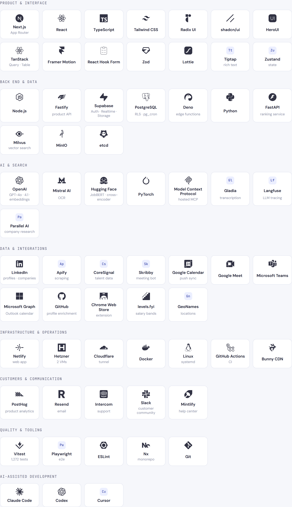

- **Product & interface:** Next.js, React, TypeScript, Tailwind CSS, Radix UI, shadcn/ui, HeroUI, TanStack Query & Table, Framer Motion, React Hook Form, Zod, Lottie, Tiptap, Zustand
- **Back end & data:** Node.js, Fastify, Supabase (Postgres, Auth, Realtime, Storage), PostgreSQL with RLS and pg_cron, Deno edge functions, Python, FastAPI, Milvus, MinIO, etcd
- **AI & search:** OpenAI (GPT-4o, GPT-4.1, embeddings), Mistral AI (OCR), Hugging Face (JobBERT, cross-encoder), PyTorch, Model Context Protocol, Gladia, Langfuse, Parallel AI
- **Data & integrations:** LinkedIn (via Apify), Apify, CoreSignal, Skribby, Google Calendar, Google Meet, Microsoft Teams, Microsoft Graph, GitHub, Chrome Web Store, levels.fyi, GeoNames
- **Infrastructure & operations:** Netlify, Hetzner (2 VMs), Cloudflare Tunnel, Docker, Linux/systemd, GitHub Actions, Bunny CDN
- **Customers & communication:** PostHog, Resend, Intercom, Slack, Mintlify
- **Quality & tooling:** Vitest, Playwright, ESLint, Nx, Git
- **AI-assisted development:** Claude Code, Codex, Cursor

## Where it stopped

Lope was paused in September 2026 and the production service has been wound down. Two steps were next: bringing CV, GitHub and interview evidence into AI Scout's ranking, and GPU inference for the search engine, which served concurrent searches one at a time on its CPU-only VM.

Built by [Nikos Mavrapidis](https://github.com/NikosMav), [Dimitrios Foteinos](https://github.com/dfwteinos) and [Anastasios Melidonis](https://github.com/Anastasios084).

## Repository note

Lope was a team project. The platform source code, search engine, customer data, production infrastructure and credentials remain private; this repository contains only the public case study. Customer organizations are not named, and candidate names and photos in the videos and screenshots are blurred. See [NOTICE.md](NOTICE.md).
